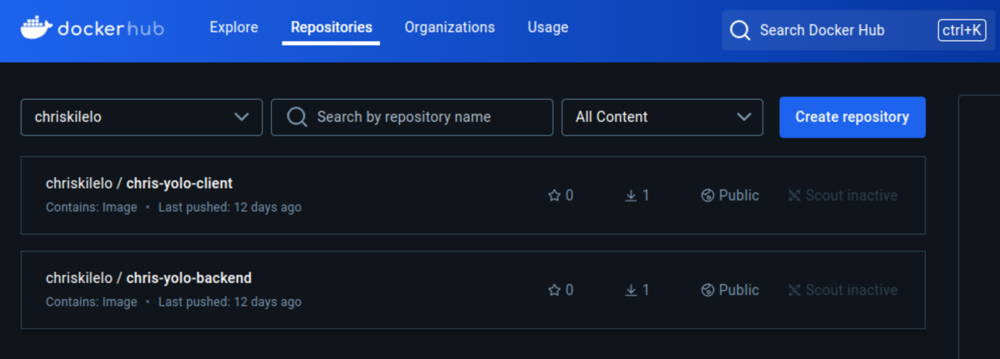

# YOLO Clothing Store

Welcome to Yolo Clothing Store – your vibrant online destination for stylish, high-quality apparel that celebrates individuality and flair! Whether you're shopping for men, women, or children, Yolo Clothing Store offers an exciting variety of pieces designed to elevate every wardrobe. 

## Table of Contents
- [About](#about)
- [Technologies](#technologies)
- [Getting Started](#getting-started)
  - [Prerequisites](#prerequisites)
  - [Installation](#installation)
- [Usage](#usage)
  - [Running the Application](#running-the-application)
  - [Stopping the Application](#stopping-the-application)
- [DockerHub Artifacts](#dockerhub-artifacts)
  - [Pulling & Running Frontend](#pulling-and-running-the-frontend-docker-image)
  - [Pulling & Running Backend](#pulling-and-running-the-backend-docker-image)
- [Contributing](#contributing)
- [License](#license)

---

## About
This is a project that is made up of a React Frontend, a NodeJS Backend and a MongoDB database. The admin can upload products and online shoppers can add products to a cart and checkout. It is a project that we used for an assignment therefore all credits go to the owner i.e. Victor - GtHub Username - Vinge1718

## Technologies
- **Docker** - Used to containerize the application
- Other technologies used (e.g., Node.js, React and MongoDB)

## Getting Started

### Prerequisites
Make sure you have the following installed:
- [Docker](https://www.docker.com/get-started)
- [Docker Compose](https://docs.docker.com/compose/install/)

### Installation
Clone the repository and navigate to the project directory:

```bash
git clone git@github.com:chriskilelo/yolo.git
cd yolo
```

## Usage

### Running the Application
1. Build and start the application using Docker:
   ```bash
   docker compose up
   ```

2. Access the application:
   - Application URL (On Local PC): [http://localhost:3000](http://localhost:your-port)
   - Application URL (Via Network): [http://172.20.0.4:3000](http://localhost:your-port)

### Stopping the Application
To stop the application, press `Ctrl+C` in the terminal if running with `docker compose up` or use:

```bash
docker compose down
```

If using Docker directly:
```bash
docker stop <container-id>
```

## DockerHub Artifacts
The frontend and the backend Docker Images have been deployed to Docker Hub and can be downloaded and deployed. Below is a screenshot of the two images on DockerHub



### Pulling and running the Frontend Docker Image
To pull the latest version of the Yolo Clothing Store backend image, use:

```bash
docker pull chriskilelo/chris-yolo-client:v1.0.1
```

```bash
docker run chriskilelo/chris-yolo-client:v1.0.1
```

### Pulling and running the Backend Docker Image
To pull the latest version of the Yolo Clothing Store backend image, use:

```bash
docker pull chriskilelo/chris-yolo-backend:v1.0.1
```

```bash
docker run chriskilelo/chris-yolo-backend:v1.0.1
```

## Contributing
Contributions are welcome! Please follow these steps:
1. Fork the repository.
2. Create a new branch.
3. Make your changes and commit them.
4. Submit a pull request.

## License
I do not know what license to use here yet :grinning:  :angel:
